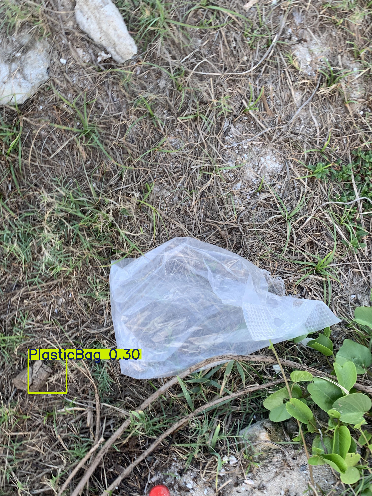

# 🌊 **Train-AI Yolov8x** 🌊

[](https://github.com/Akshay090/svg-banners)
# *“เทรน AI เพื่อตรวจจับขยะริมหาด”*

---

## 🚀 **ภาพรวมโปรเจกต์**

โปรเจกต์นี้เป็นส่วนหนึ่งของงานที่ส่งอาจารย์ โดยรวมพลังจากสมาชิกทุกคนในทีม

- **เป้าหมายของเรา**: ตรวจจับ จำแนก และวิเคราะห์ขยะริมหาด 🌍
- **Model Result**: [Download Model](https://drive.google.com/file/d/1xebvoE0ZPMmgB0t7R7qJWXPVNKYOyzZW/view?usp=sharing)

---

## 📊 **การเตรียมชุดข้อมูล**

### การเก็บข้อมูล
- เราเก็บรวบรวมภาพขยะริมหาดจากสมาชิกทุกคนในทีม รวมถึงขยะหลากหลายประเภท เช่น ขวดพลาสติก ขวดแก้ว ก้นบุหรี่ และอื่น ๆ
- ชุดข้อมูลของเรามีมากกว่า **20 คลาส** รวมถึงวัสดุธรรมชาติและสังเคราะห์ (เช่น PlasticBottle, GlassBottle, NaturalWood, Shell เป็นต้น)

### การแบ่งชุดข้อมูล
| Data Split    | เปอร์เซ็นต์ | ใช้งาน |
| ------------- | ----------- | ------- |
| Train         | 80%         | ฝึกโมเดล |
| Validation    | 10%         | ปรับพารามิเตอร์ |
| Test          | 10%         | ทดสอบขั้นสุดท้าย |

---

## 🛠️ **การฝึกโมเดล**

### สภาพแวดล้อมที่ใช้
- ใช้คอมพิวเตอร์ส่วนตัว + GPU
- โมเดล **YOLOv8x**
- [Dataset](https://drive.google.com/drive/folders/106s8xNw3sjNEKvDBVwHfp3GLInm0BhNO)

| โปรแกรมที่เขียนขึ้นเอง   | ใช้ทำอะไร | หมายเหตุ |
| ------------- | ----------- | ------- |
| [Convert2Yolo.py](Script/Convert2Yolo.py)         | แปลงไฟล์ Data เพื่อเทรนกับ YOLO         | reuse code จากอาจารย์ |
| [ImageLabeling.py](Script/ImageLabeling.py)    | โปรแกรมทำ Lable         | reuse code จากอาจารย์ |
| [date_img.py](Script/date_img.py)          | เปลี่ยนชื่อไฟล์ตามกำหนด         | เขียนเอง |
| [main.py](Script/main.py)          | ใช้ auto tune และ train ai         | เขียนเอง |

### การปรับ Hyperparameters ด้วย Optuna
เราใช้ **Optuna** เพื่อหา Hyperparameter ที่ดีที่สุด: ( โค้ดตัวอย่าง )

```python
import optuna
from ultralytics import YOLO

def objective(trial):
    params = {
        'lr0': trial.suggest_loguniform('lr0', 1e-5, 1e-1),
        'momentum': trial.suggest_uniform('momentum', 0.6, 0.98),
        'weight_decay': trial.suggest_loguniform('weight_decay', 1e-5, 1e-2),
        'batch_size': trial.suggest_categorical('batch_size', [8, 16, 32]),
    }

    model = YOLO('yolov8x.yaml')
    results = model.train(data='config.yaml', epochs=100, **params)
    return results['metrics/mAP_0.5']

study = optuna.create_study(direction='maximize')
study.optimize(objective, n_trials=20)

print('Best hyperparameters:', study.best_params)
```

### ขั้นตอนการฝึก
- เทรนโมเดลด้วยชุดข้อมูล พร้อมตรวจสอบผ่าน Validation Set
- เทรนจนค่า Loss คงที่และประสิทธิภาพโอเค

---

## 📈 **การทดสอบโมเดล**

### วิธีการทดสอบ
- เราใช้โมเดลที่ฝึกเสร็จแล้วในการทดสอบกับ **Test Set** ซึ่งเป็นภาพที่โมเดลไม่เคยเห็นมาก่อน
- วัดผลด้วยเมตริกซ์มาตรฐานสำหรับการตรวจจับวัตถุ:
  - **mAP (Mean Average Precision)**: วัดประสิทธิภาพโดยรวมของทุกคลาส
  - **Precision** และ **Recall**: วัดความแม่นยำและความครอบคลุมของการตรวจจับ
  - **Confusion Matrix**: แสดงผลการจำแนกคลาสแบบ Multi-class

### ผลลัพธ์
นี่คือผลลัพธ์สำคัญจากการทดสอบ:

#### กราฟ Precision-Recall
  
- **mAP@0.5 โดยรวม**: 0.179  
- **คลาสที่ทำได้ดี**:
  - FireLighter: 0.995  
  - GlassBottle: 0.527  
- **คลาสที่ท้าทาย**:
  - คลาสเช่น Can, MilkBox, Paper, และ CigaretteButt ได้คะแนน 0.000 ซึ่งบ่งบอกถึงประสิทธิภาพที่ต่ำ

#### Confusion Matrix (แบบ Normalized)
  
- Confusion Matrix แบบ Normalized แสดงความแม่นยำในการจำแนกแต่ละคลาส
- **จุดแข็ง**: FireLighter (1.00) และ Other_Plastic (0.91) มีความแม่นยำสูง
- **จุดอ่อน**: มีการจำแนกผิดพลาดในคลาสเช่น NaturalWood และ Shrimp ซึ่งอาจเกิดจากความคล้ายคลึงของลักษณะภาพ

#### กราฟ Precision-Confidence, Recall-Confidence และ F1-Confidence
- **Precision-Confidence Curve**: แสดงความแม่นยำเมื่อปรับ Confidence Threshold
- **Recall-Confidence Curve**: แสดงความครอบคลุมเมื่อปรับ Confidence Threshold
- **F1-Confidence Curve**: คะแนน F1 สูงสุดที่ 0.16 เมื่อ Confidence Threshold อยู่ที่ 0.080

---

## 🌟 **การวิเคราะห์ผลลัพธ์**

### ข้อมูลและขั้นตอนการฝึก
- **การเก็บข้อมูล**: ชุดข้อมูลมีความหลากหลายแต่ไม่สมดุล บางคลาส (เช่น FireLighter) มีตัวอย่างมากกว่าคลาสอื่น (เช่น MilkBox, Can) ซึ่งอาจส่งผลต่อประสิทธิภาพ
- **ขั้นตอนการฝึก**: YOLOv8x ทำงานได้ดีกับวัตถุที่มีลักษณะชัดเจน แต่มีปัญหากับวัตถุขนาดเล็กหรือที่มีลักษณะคล้ายกัน (เช่น CigaretteButt กับ NaturalWood)

### ตัวอย่างทั้งหมด

- ∧,,,∧
- (  ̳• · • ̳)
- /    づ  [เปิดโฟลเดอร์](https://github.com/ibo/myproject/tree/main/assets/images)

### ตัวอย่างที่สำเร็จ
- **การตรวจจับ FireLighter**: ได้คะแนน mAP 0.995 อาจเป็นเพราะลักษณะที่ชัดเจนและสีที่แตกต่าง
- **การตรวจจับ GlassBottle**: ได้คะแนน 0.527 แสดงถึงความสามารถในการจัดการกับวัตถุโปร่งใส

### ตัวอย่างที่ล้มเหลว
- **CigaretteButt และ MilkBox**: ทั้งสองคลาสได้คะแนน 0.000 แสดงว่าโมเดลไม่สามารถตรวจจับได้ อาจเป็นเพราะขนาดเล็กหรือมีตัวอย่างในชุดข้อมูลไม่เพียงพอ
- **การจำแนกผิดพลาด**: Confusion Matrix แสดงถึงการสับสนระหว่าง NaturalWood กับ Shrimp ซึ่งอาจเกิดจากความคล้ายคลึงของลักษณะ

---

## 🔮 **แนวทางการพัฒนาในอนาคต**

เพื่อเพิ่มประสิทธิภาพของโมเดล เราเสนอแนวทางดังนี้:
1. **เพิ่มข้อมูล (Data Augmentation)**: เพิ่มปริมาณข้อมูลและปรับสมดุลคลาสด้วยเทคนิคเช่น การหมุนภาพ การปรับขนาด และการเปลี่ยนสี
2. **ปรับแต่งเฉพาะคลาส**: เน้นพัฒนาการตรวจจับคลาสที่ทำได้ไม่ดี (เช่น CigaretteButt, MilkBox) โดยเพิ่มตัวอย่างหรือใช้เทคนิคฝึกแบบเฉพาะ
3. **ปรับแต่ง Hyperparameters เพิ่มเติม**: ทดลองกับพารามิเตอร์เช่น IoU Threshold และ Anchor Box เพื่อให้เหมาะสมกับชุดข้อมูล
4. **ใช้ Ensemble Methods**: รวม YOLOv8x กับโมเดลอื่น (เช่น Faster R-CNN) เพื่อเพิ่มความแม่นยำ
5. **ทดสอบในสถานการณ์จริง**: นำโมเดลไปใช้ในสถานการณ์จริง เช่น บนโดรนหรือกล้องริมหาด เพื่อตรวจสอบประสิทธิภาพ

---

## 🖼️ **ตัวอย่างการตรวจจับ**

### ตัวอย่างที่สำเร็จ
  
*คำอธิบาย*: การตรวจจับ FireLighter บนชายหาดได้อย่างชัดเจน ด้วยคะแนนความมั่นใจ 0.98

### ตัวอย่างที่ล้มเหลว
  
*คำอธิบาย*: โมเดลไม่สามารถตรวจจับตรงจุดได้ อาจเป็นเพราะ Lable ไม่ดี

---
[](https://github.com/Akshay090/svg-banners)
| ชื่อ    | รหัสนักศึกษา |
| ------------- | ----------- |
| นายอัสนีย์ วงศ์สุวรรณ         | 167404910002         |
| นายณัฐชณนท์ นุชโร         | 167404910008         |
| นางสาววรนาถ เรืองขจร         | 167404910019         |
| นายนรินทร ชื่นจิตร         | 167404910012        |
| นายภุมรัตน์ พรหมวิหาร         | 167404910029        |
| นายนราธิป ไชยยศ        | 167404910011        |

-ˋˏ✄┈┈┈┈┈┈┈┈┈┈┈┈┈┈┈┈┈┈┈┈┈┈┈┈┈┈┈
